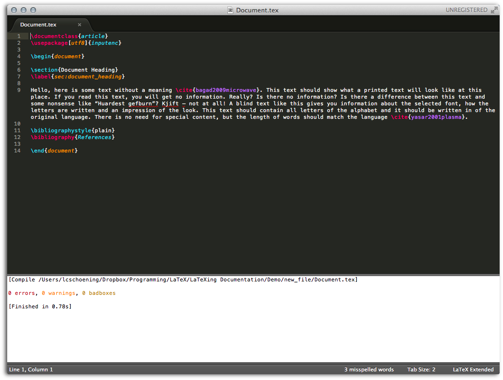

# First Steps with LaTeXing!!

## Create a new TeX File

LaTeXing provides several templates for creating a new LaTeX file; the
templates are very elementary and nothing fancy. You can easily add your own
snippets, please check the ST website for more details. For this tutorial we
choose the article template.

## Save Document.tex

The first thing we have to do is save the file as **Document.tex**; the
extension must be typically, **.tex**. After saving, syntax highlighting will
also become available, if enabled in the settings. Now we add some content to
the file, which also includes a bibliography file.

## Bibliography File

Everything here is LaTeX standard and not really related to LaTeXing, so if
you are not comfortable with this step please check any well-known LaTeX
information website, such as [wikibooks.org/wiki/LaTeX][wikibooks].

## Fill a Reference

After saving the bibliography file as **References.bib** at the same location
as the **Document.tex** LaTeX file, you can use the LaTeXing fill command to
choose your reference and select an item from the list.

## Build

After we have finished adding content and hitting `cmd + b` on OS X (or the
equivalent key combination on other platforms), the LaTeX document will
compile. A log panel, located at the bottom of the screen, will appear and
show information such as compile time, errors, warnings, or badboxes, if
present. In this document everything is fine, so less than a second after, the
PDF document will be available.

## The Working Directory

The file structure is fairly simple, but to avoid any misunderstanding (shown
below), the output folder is set to *Output* (which can be customized),
relative to the current working directory.

[wikibooks]: http://en.wikibooks.org/wiki/LaTeX
