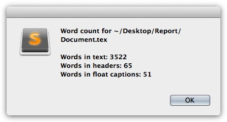

# Further Commands without a Keybinding

These commands are available from the command palette. Some of these commands
in this section are also available via a key binding, therefore you have to
check the corresponding section in the key bindings for these commands.

## Check System

LaTeXing requires different command-line tools to support all functions. The
most important command-line tool (and mandatory for compilation) is "latexmk".
The "latexmk" tool is shipped with all big LaTeX distributions, such as
TeXlive, MacTeX, and MikTeX; for others it may be required to install it
manually.

LaTeXing offers a tool to check if all required tools (latexmk, perl,
texcount, kpswhich, mthelp for MikTeX, texdoc for TeXlive or MacTeX) are
available in your system; to run it, click on Tools > Packages > LaTeXing >
Check System. Some of these commands, like "texdoc", are not mandatory but are
still helpful during your daily work. Attached to the test, LaTeXing opens a
window with a list of all the required tools and the total status of your
system.

## Lookup TeX Symbol

Opens the browser at [detexify.kirelabs.org][detexify], on this website you
can sketch a symbol and see the possible latex commands to generate it.

## Phrases Dictionary

Open any available phrase dictionary.

## Synchronise Remote Data

If you changed any remote data like on Bibsonomy, Citeulike, Mendeley or
Zotero you can synchronise the data by using this command. There is a
different between rebuilding the cache and this command, this command will
just refetching updated items rather than fetching all available items.

## Update Bibliography File(s)

After you already synchronised your remote data, the content of a bibliography
could be different, with this command the cached data and the bibliography are
going to compared and if required the bibliography file filled with the
required informations.

## Rebuild Cache

One new feature of LaTeXing 0.8 is a cache function to improve the working
speed with big projects. With this command you can rebuild the cache on the
soft way which means that just the timestamps are going to be adjusted and you
are not cleaning the cache rather than just re-fetching all informations.

## Rebuild Cache (Hard)

This command is rebuilding the cache on a hard way, deleting all files and be
ready to build the cache new while working from scratch. Normally this
shouldn't be required because LaTeXing is also checking the cache every
startup for unavailable cached options to keep the cached data small. If you
have problems, please rebuild the cache anyway.

## Texcount

The word count of LaTeX files isn’t always an easy task but with LaTeXing this
is very easy. This feature uses the command line tool texcount and gives a
message after executing with the total words, the words in headers as well as
the word in captions.

[bibsonomy]: http://www.bibsonomy.org
[citeulike]: http://www.citeulike.org
[detexify]: http://detexify.kirelabs.org/classify.html
[mendeley]: http://www.mendeley.com
[zotero]: http://www.zotero.org