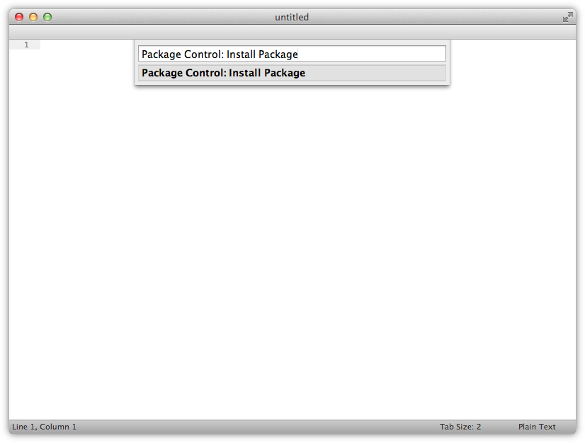
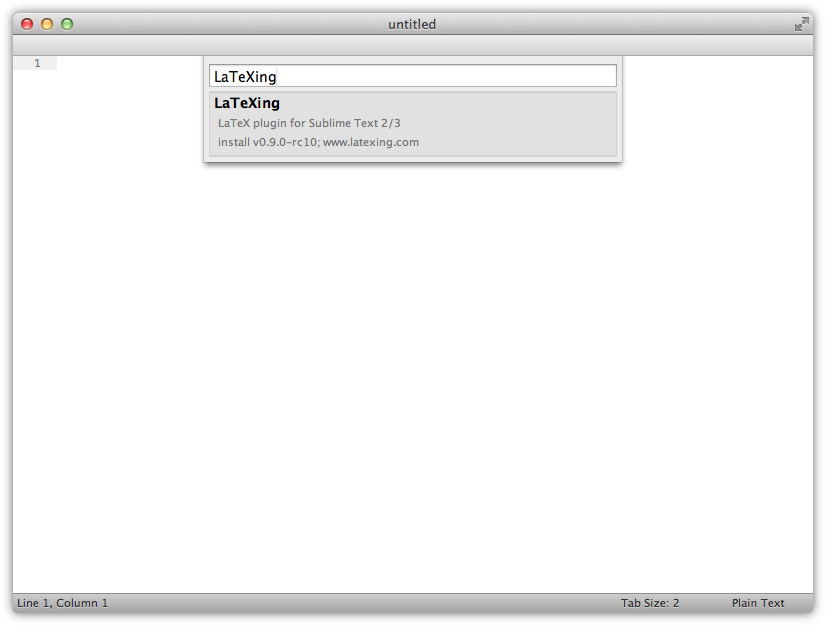
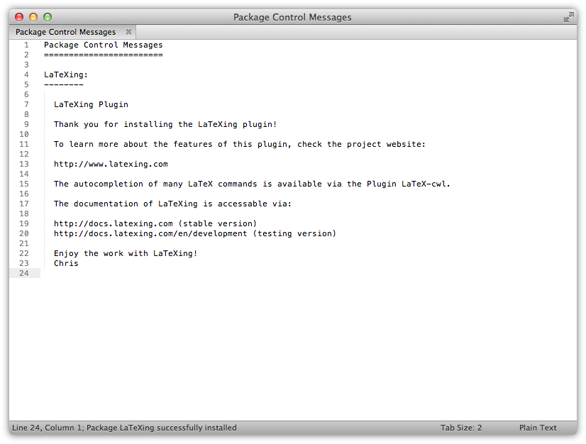
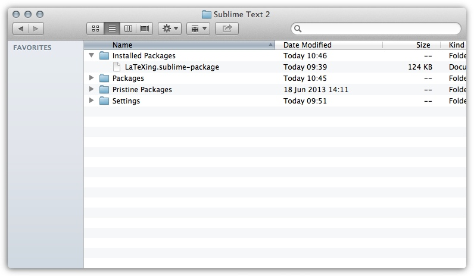
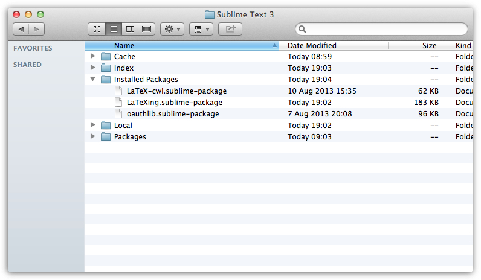
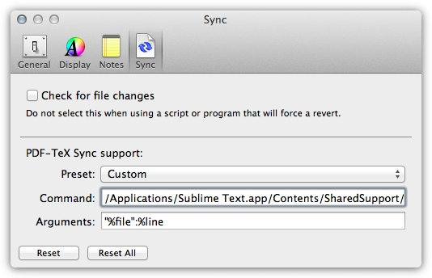
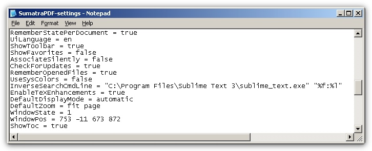
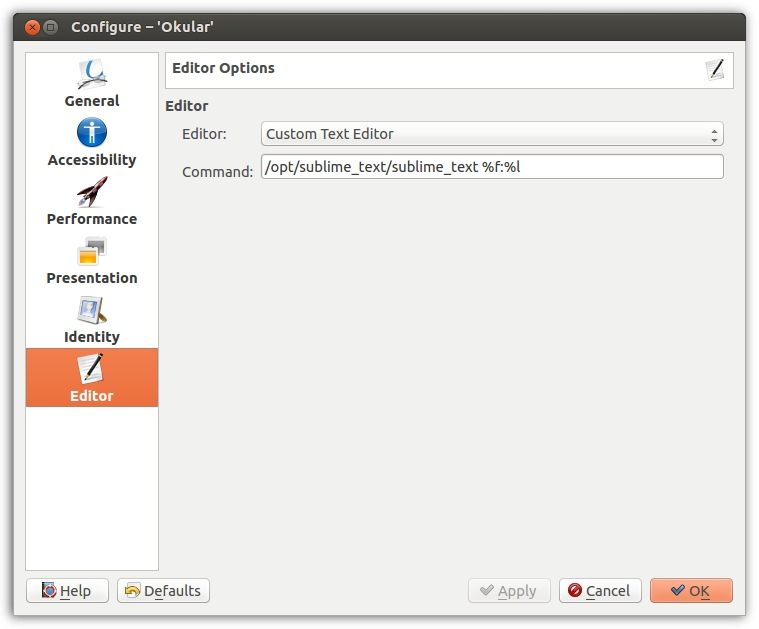
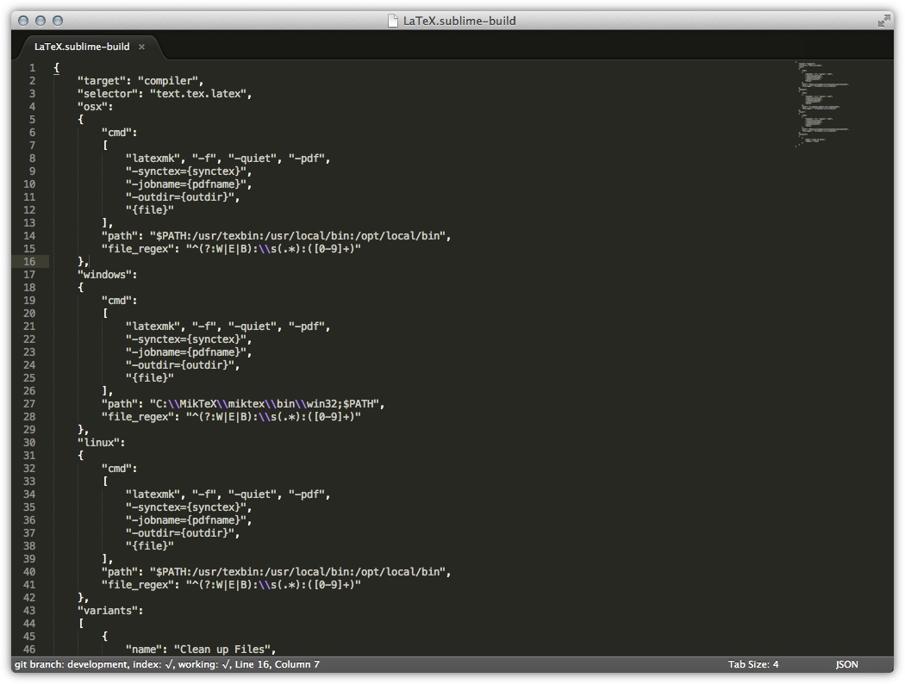
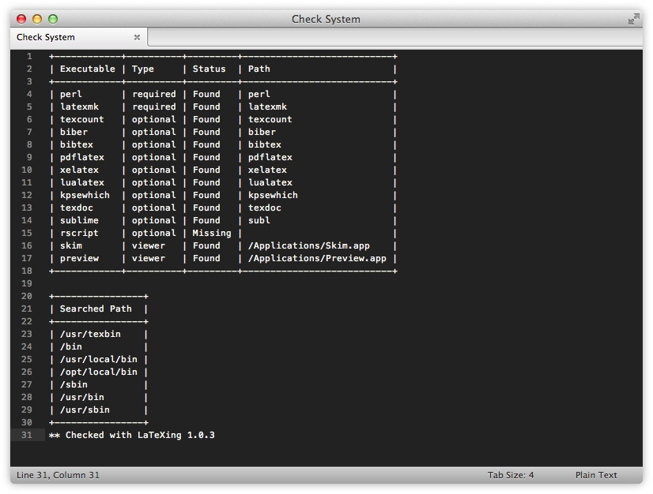

# Introduction

The first time use of LaTeXing with Sublime Text can be sometimes a bit
difficult, just take your time and ready this documentation.

### Automatic Control Package Installation

The installation of LaTeXing via the popular Sublime Text plugin "package
control" is very easy and fundamental. If you do not have that plugin
installed, please see [here][pc] for details on how to install it. If you do
not wish to use package control, please follow the simple manual installation.

#### Start Package Control: Install Package

Please start the command palette (click Tools > Command Palette...) inside
Sublime Text 3 and select Package Control: Install Package. The package
control plugin will now fetch all necessary meta- details of the available
plugins and list all extensions for the current system.

#### Install LaTeXing Package

After fetching the data, you need to select the LaTeXing package from that
list at this point; the version number of the plugin may vary.

A moment later, the status message *Package LaTeXing successfully installed*
should appear on the status bar and the initial message of LaTeXing show.

> The version for Sublime Text 2 is marked as deprecated, the version will
> still receive bug fix if required but the active development is focused on
> Sublime Text 3.
>
> **To work with Mendeley and Zotero you need the package oauthlib available
> from the package control.**

### Manual Installation

If you do not wish to use package control, please follow the following steps
to install LaTeXing manually:

**Sublime Text 2 (Deprecated)**

1. Click the Preferences > Browse Packages... menu entry
2. Go up one directory and then open the Installed Packages folder
3. Download [ST2 version][v2] and copy it into the Installed Packages
   directory
4. Restart Sublime Text 2

**Sublime Text 3**

1. Click the Preferences > Browse Packages... menu entry
2. Go up one directory and then open the Packages folder
3. Download [ST3 version][v3] and copy it into the Installed Packages
   directory
4. Restart Sublime Text 3

### Testing Version

If you would like to try out the latest version of LaTeXing you can use the
testing repository, `http://testing.latexing.com/packages.json`, this version
is under active development and is not recommended for the use on productive
systems. If you found a bug in this version please visit [github][issues_latexing]
and report the problem or get in [touch][support] via email.

The configuration file of package control should at least contain the
following informations:

    {
      "install_prereleases": true,
      "repositories":
      [
        "http://testing.latexing.com/packages.json",
      ]
    }

The documentation for the testing version is earliest available via
[http://docs.latexing.com/testing.html][testing_latexing], but it could
also be that a new function is not supported prior release on the testing
channel.

## LaTeXing Configuration

### Requirements

The first thing you need is Sublime Text, the plugin is compatible with both
Sublime Text 2 and 3. The Sublime Text 3 version is being actively developed
and will keep receiving new features; the last compatible version for Sublime
Text 2 is any version below 0.6. So make sure that you are on a supported
version before reporting any problems or bugs on
[github][issues_latexing].

Second, get the LaTeXing plugin, as explained (in two different ways) here see
installing-label. The easiest way is to complete the installation via the
Package Control, but a manual installation is also simple and explained in the
document.

### OS X

On OS X you need to be running the [MacTeX][mactex] distribution (which is the
most popular distribution on a Mac system anyway). If you encounter a problem
while e.g. compiling the LaTeX file please update the distribution to the
latest version before reporting any bugs. Normally the plugin should work on
both 32 and 64 bits without limitations and in the exact same way.

**Skim**

The [Skim PDF reader][skim] is recommended. Just download and install these
two the usual way. Please setup the path in LaTeXing.sublime-settings, see
check\_your\_system-label to check your system and be sure that Skim can be
found by LaTeXing. To configure inverse search, open the preferences dialog of
the Skim app, select the sync tab, select Sublime Text 2 under the present;
deselect the "Check for file changes" option. If you use an old version
without an existing profile for Sublime Text 2 or using Sublime Text 3 with a
different path do following:

1. Deselect the "Check for file changes" option
2. Preset: Custom
3. Command: `/Applications/Sublime Text.app/Contents/SharedSupport/bin/subl`
4. Arguments: `"%file":%line`

In case you have created a symbolic link to Sublime Text somewhere in your
path, you can also use that in the command field. The above instructions will
work in any case though, and do not require that you create a symbolic link.
After setting up the path in preference, Skim should look similar to this one:

**Preview**

To use Preview you just have to setup the path in LaTeXing.sublime-settings.
Please see check your system and be sure that Preview can be found by
LaTeXing.

> **Preview will ignore forward\_sync and reverse\_sync.**

### Windows

On Windows your can either use [MikTeX][miktex] or [TeXLive][texlive]. Both
distributions are supported, but support for [TeXLive][texlive] is **better**.
If you encounter a problem while e.g. compiling the LaTeX file please update
the distribution to the latest version before reporting any bugs. Normally the
plugin should work on both 32 and 64 bits without limitations and in the exact
same way.

> Tip for Windows users when using MikTeX: Install MikTeX first, then install
> Perl manually. Run the basic commands like latexmk and texcount from command
> prompt to force MikTeX to install these Perl scripts automatically!

**SumatraPDF**

Be sure that you are running a current version of the [Sumatra PDF][sumatra].
Just download and install these the usual way. Please setup the path in
LaTeXing.sublime-settings, see check your system and be sure that SumatraPDF
can be found by LaTeXing. To configure the inverse search, open Sumatra PDF
and do the following:

1. Click Settings > Advanced Options
2. Find the option **InverseSearchCmdLine**
3. Set value to: `"C:\Program Files\Sublime Text 3\sublime_text.exe" "%f:%l"`.

If you do not have the option just append a new line at the end of the file.

The path of the executable file may vary if you changed it during installation
or for different Sublime Text versions, but for a standard installation of
Sublime Text 3 this should work. Just check the path within explorer if you
are not sure about the location.

As an alternative to the graphical way, you can use the command-line to save
the inverse search settings. In this case, open the command-line console and
execute the following command:

`"C:\Program Files\SumatraPDF\SumatraPDF.exe" -inverse-search "\"C:\Program
Files\Sublime Text 3\sublime_text.exe\" \"%f:%l\"`

The absolute path to SumatraPDF can vary, please adjust the path or use the
GUI method. After setting up the path in the preference, SumatraPDF should
look similar to this one:

**Foxit Reader**

To use Foxit Reader you just have to setup the path in LaTeXing.sublime-
settings. Please see check your system and be sure that Foxit Reader can be
found by LaTeXing.

> **Foxit Reader will ignore forward\_sync and reverse\_sync.**

**PDF XChange Viewer**

To use PDF XChange Viewer you just have to setup the path in LaTeXing.sublime-
settings. Please see check your system and be sure that PDF XChange Viewer can
be found by LaTeXing.

> **PDF XChange Viewer will ignore forward\_sync and reverse\_sync.**

**Adobe Reader**

To use Adobe Reader you just have to setup the path in LaTeXing.sublime-
settings. Please see check your system and be sure that Adobe Reader can be
found by LaTeXing.

> **Adobe Reader will ignore forward\_sync and reverse\_sync.**

### Linux

On Linux your can use [TeXLive][texlive] which is available for the most Linux
distributions. LaTeXing is supporting Evince and Okular as pdf viewer. If you
encounter a problem while e.g. compiling the LaTeX file please update the
distribution to the latest version before reporting any bugs. Normally the
plugin should work on both 32 and 64 bits without limitations and in the exact
same way.

**Evince**

To use Evince you just have to setup the path in LaTeXing.sublime-settings.
Please see check your system and be sure that Evince can be found by LaTeXing.

**Okular**

To use Okular with LaTeXing you just have to setup the path in LaTeXing
.sublime-settings. Please see check your system and be sure that Okular can be
found by LaTeXing. To configure the inverse search, open Okular and do the
following:

1.  Click Settings > Configure Okular
2.  Select the Editor tab
3.  Editor: Custom Text Editor
4.  Command: `/opt/sublime_text/sublime_text %f:%l`

## Check your sublime-build

Before you can start your work, you need to check the "LaTeX.sublime-build"
file within the plugin directory of LaTeXing to make sure that the
configuration reflects your preferred TeX distribution. Open the file by
selecting `Preferences > Package Settings > LaTeXing > Settings - Extended`
and check the corresponding settings of the block for the keyword "path". By
default MacTeX is configured for OS X and in the figure below MikTeX is used
for Windows. Make sure that you do not change anything else apart from the
path, if you are not sure what are you doing.

If you think you configured everything correctly, please run the supplied
LaTeXing system check tool (explained below) to make sure that LaTeXing will
work without issues.

## Check your System

LaTeXing requires different command-line tools to support all functions. The
most important command-line tool (and mandatory for compilation) is "latexmk".
The "latexmk" tool is shipped with all big LaTeX distributions, such as
TeXlive, MacTeX, and MikTeX; for others it may be required to install it
manually.

LaTeXing offers a tool to check if all required tools (latexmk, perl,
texcount, kpswhich, mthelp for MikTeX, texdoc for TeXlive or MacTeX) are
available in your system; to run it, click on Tools > Packages > LaTeXing >
Check System. Some of these commands, like "texdoc", are not mandatory but are
still helpful during your daily work. Attached to the test, LaTeXing opens a
new view with a list of all the required tools and the total status of your
system.

[pc]: http://wbond.net/sublime_packages/package_control/installation
[v2]: http://release.latexing.com/2/LaTeXing.sublime-package
[v3]: http://release.latexing.com/3/LaTeXing.sublime-package

[texlive]: http://www.tug.org/texlive
[miktex]: http://miktex.org
[mactex]: http://tug.org/mactex/

[latexing]: http://www.latexing.com
[issues_latexing]: https://github.com/LaTeXing
[support]: http://www.latexing.com/contact.html
[testing_latexing]: http://docs.latexing.com/testing.html
[skim]: http://skim-app.sourceforge.net
[sumatra]: http://blog.kowalczyk.info/software/sumatrapdf/free-pdf-reader.html
