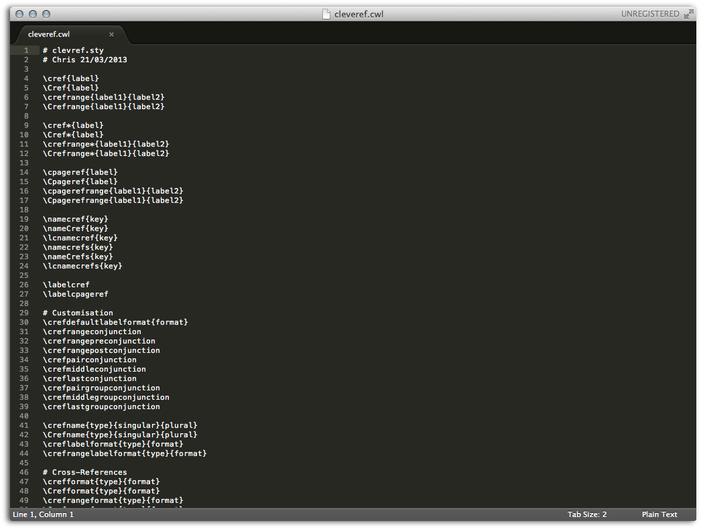
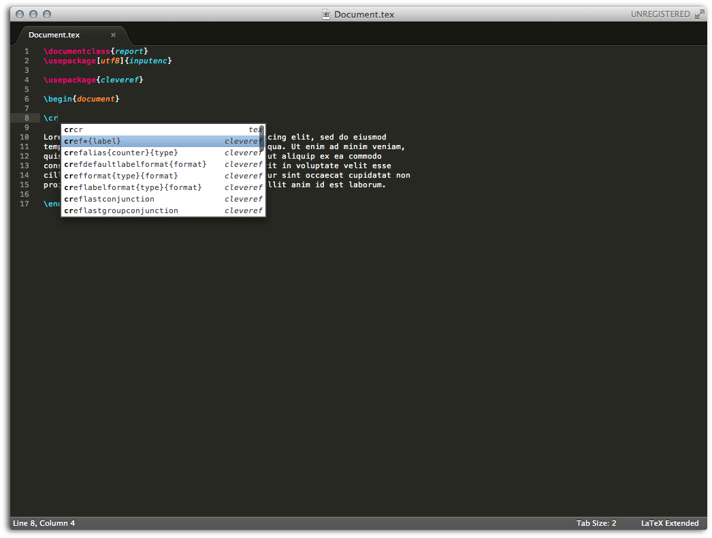
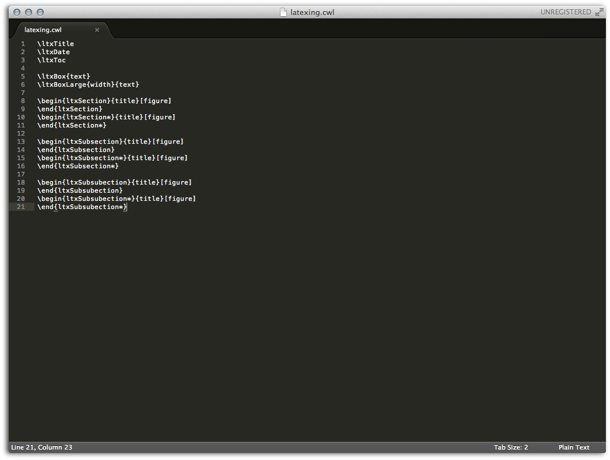
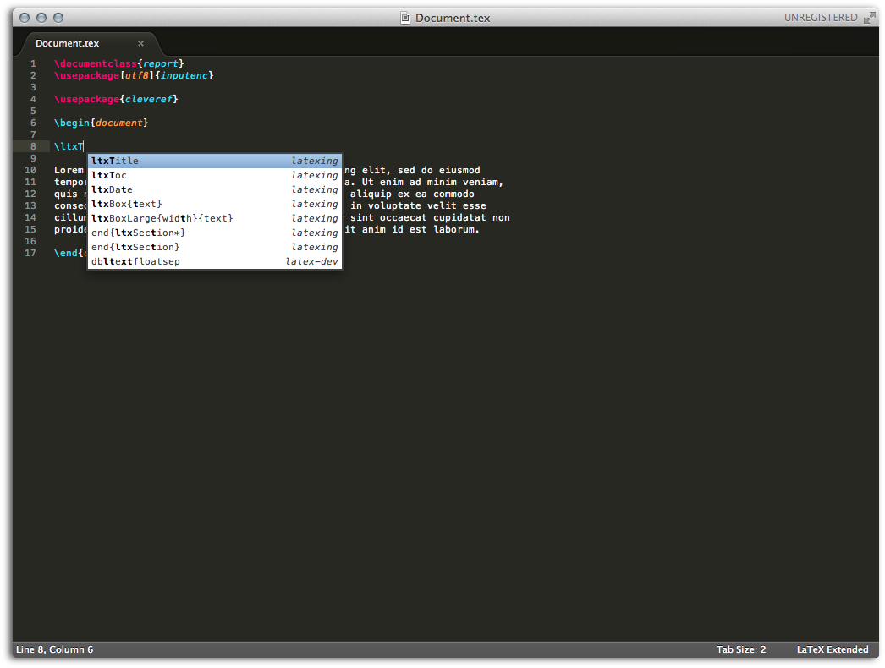

# Cwl Support of LaTeXing

LaTeX has many commands; perhaps too many to remember them all;
Especially if you are just starting to use LaTeX, it is difficult to
remember even the most important of them. With cwl files it is possible
to autocomplete many LaTeX commands while writing.

By default LaTeXing loads the following cwl files for every file (this list
can be adjusted in the LaTeXing settings): tex.cwl, latex-209.cwl, latex-
dev.cwl, latex-document.cwl, latex-l2tabu.cwl, latex-mathsymbols.cwl.

LaTeXing offers two different ways to include cwl files:

1.  Using the [LaTeX-cwl][latex_cwl] plugin
2.  Save your own cwl files in the Sublime Text package directory under:
    Packages/User/cwl (files in this folder are of higher priority and will
    override files from the LaTeX-cwl plugin)

Perhaps this way of using a different plugin for the cwl files looks more
complicated right now, but it will make sense in the long run because there
are A LOT of packages and this way it is possible to update LaTeX-cwl more
often and independently of the LaTeXing event cycle.

If you create your own cwl files for missing packages please consider to
submit your work to the github [repository][latex_cwl], if you have
difficulties with [github.com](github) just drop an [email][support]. On this
way it could be possible to have one day a complete collection of cwl files
which could be also used also from different project and not just
[LaTeXing][latexing].

## Typical cwl file

A typical cwl file, here of the cleveref package, is shown below. This
document gives an overview on how to enable cwl support or add custom customs.

## Include Package and use Autocomplete

LaTeXing covers the dynamic load of cwl files by detecting the use packages.
After the package was included on line 4 the package commands are available in
the autocomplete drop down menu. On the right side of the list is the source
file of the command shown, here cleveref.

## Create Custom cwl Files

If you created some user commands which are difficult to remember, you can
create a custom cwl file like this one here, which is useful to write LaTeXing
documentations. Just save the created cwl file in the Sublime Text package
directory under: Packages/User/cwl and include the file in the LaTeXing
static\_cwl sublime-settings.

## Use Custom cwl Files

After including the custom cwl file in the static\_cwl sublime-settings you
can use the commands like every other normal command. These files have a
higher priority and will override files from the LaTeX-cwl plugin, if you have
files with the same name.

[latexing]: http://www.latexing.com
[latex_cwl]: https://github.com/Chris—/LaTeX-cwl
[github]: http://www.github.com
[support]: mailto:support@latexing.com
