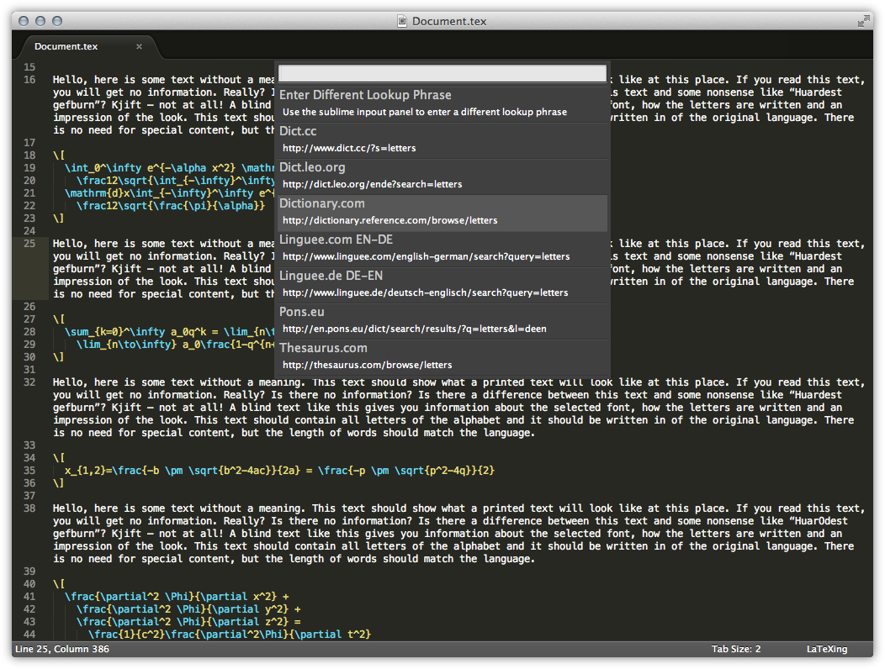
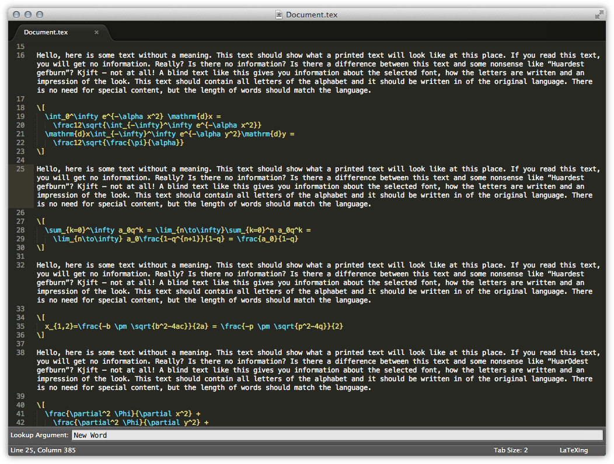
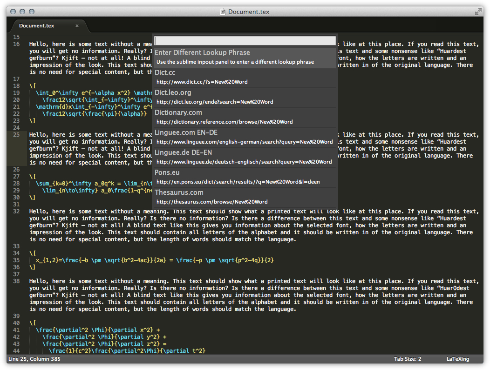

# Use Online Lookup for Definition or Translation

For that you just have to select a word and press `cmd + l, cmd + d`, a quick
panel will appear and let you choose between different actions. If you are
writing a text in LaTeX with LaTeXing it is easy to find a translation,
definition, or just a different word for a word in your text.

If you select an action in that menu it will open the url, shown in the second
row of the item. If you wish to search for a different word you can choose
“Enter Different Lookup Phrase” and enter an individual word. The same will
happen if you run the command without selecting a word or being at the
border of a word.

Now LaTeXing offers a quick panel for the new entered word.

You can fully customise the search by adjusting the “online\_lookup” setting
for your preferences. The default settings are, while {query} represents the
word in every url.

    {
      “title”: “Dict.cc”,
      “url”: “http://www.dict.cc/?s={query}”
    },
    {
      “title”: “Dict.leo.org”,
      “url”: “http://dict.leo.org/ende?search={query}”
    },
    {
      “title”: “Dictionary.com”,
      “url”: “http://dictionary.reference.com/browse/{query}”
    },
    {
      “title”: “Linguee.com EN-DE”,
      “url”: “http://www.linguee.com/english-german/search?query={query}”
    },
    {
      “title”: “Linguee.de DE-EN”,
      “url”: “http://www.linguee.de/deutsch-englisch/search?query={query}”
    },
    {
      “title”: “Pons.eu”,
      “url”: “http://en.pons.eu/dict/search/results/?q={query}&l=deen”
    },
    {
      “title”: “Thesaurus.com”,
      “url”: “http://thesaurus.com/browse/{query}”
    }
