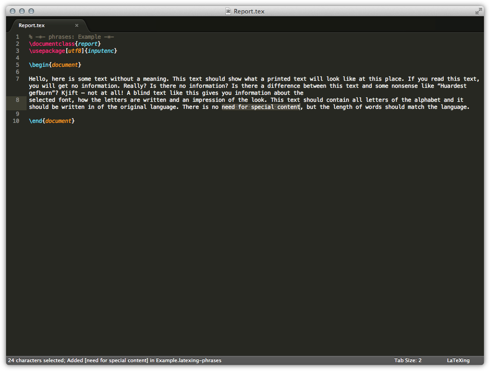
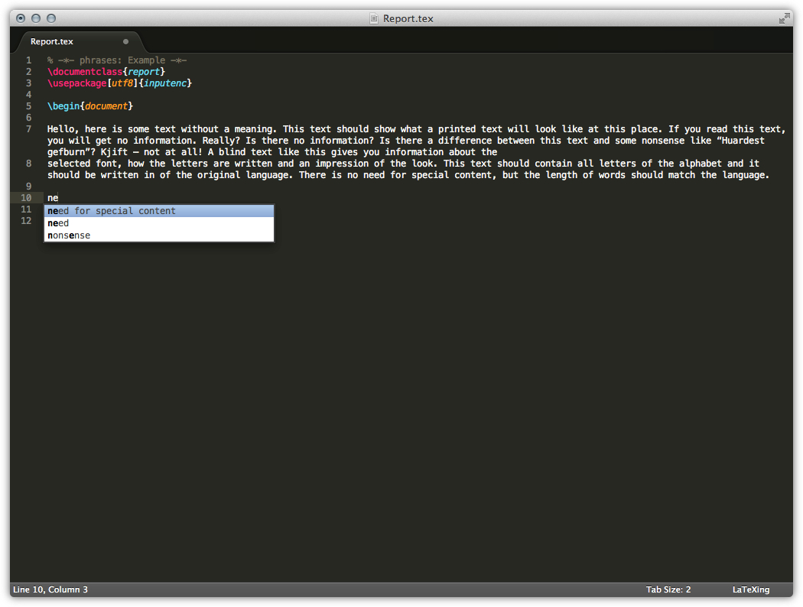
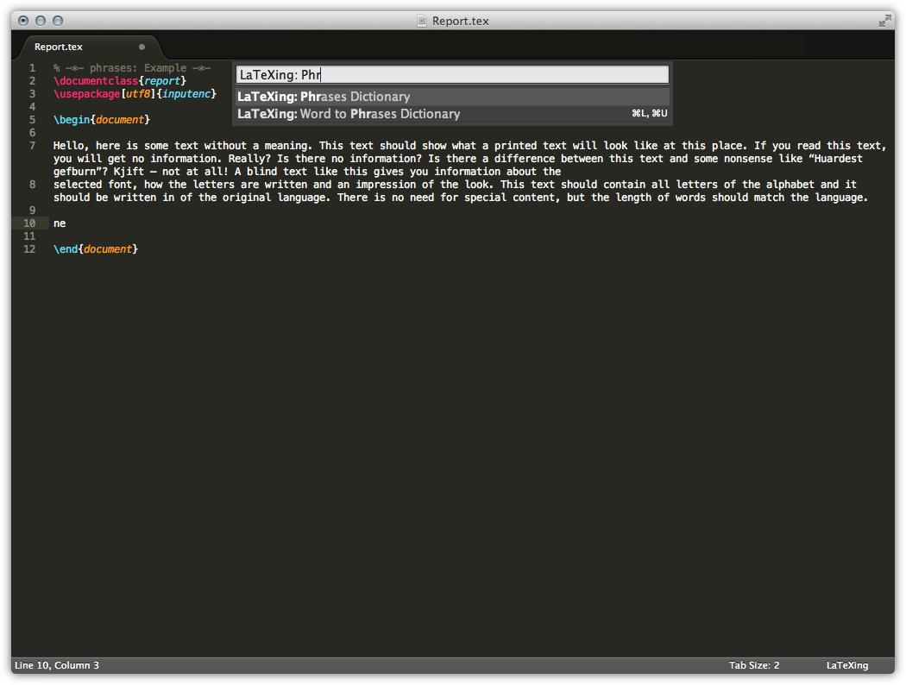
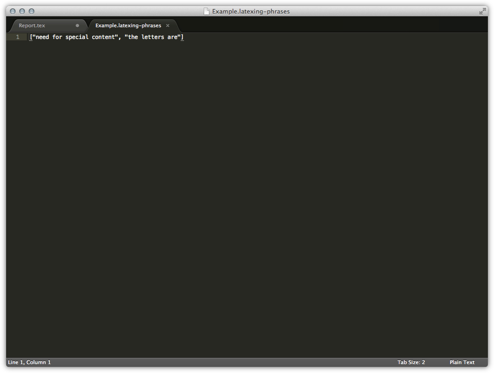

# Phrases in LaTeXing

If you are writing a big project you do often have phrases which you always
need, the default auto completion of Sublime Text do not complete multiple
words. For this purpose LaTeXing can supply this often used phrases, there are
two modes, the automatic mode of detecting often used phrases and the
opportunity to define a dictionary of phrases.

## Automatic Mode

With the automatic mode you don't have to do anything expect adjusting the
settings, the **phrase\_mode** must be 1 (for parsing the current file) or 2
(for parsing the while project). Both options are also including the manual
mode as well, if specified.

> Prior version 0.8 this function can slow down the auto completion
> significant if you are working on large projects.

## Manual Mode

The manual mode is simple, you just have to add the option `phrases` to your
file. Now you can start filling the dictionary by selecting a phrase and
adding these phrase to your dictionary. The key combination for this can be
found here phrases-label or this is available from the command palette as
well.

A status message will confirm this import with a message, if the successful.

> If you defined multiple dictionaries you have to choose where you would like
> to save the current selection prior import.

If you are opening the auto completion now you can also see the just added
phrase.

You can also check the content of the phrases dictionary from within LaTeXing
they are saved directly in you user dictionary. Just select the the command
`Phrases Dictionary` and selected the right dictionary to open.

As you can see, the phrases dictionaries are just ordinary json list
structures. You can also add words straight rather than using the import
command.
