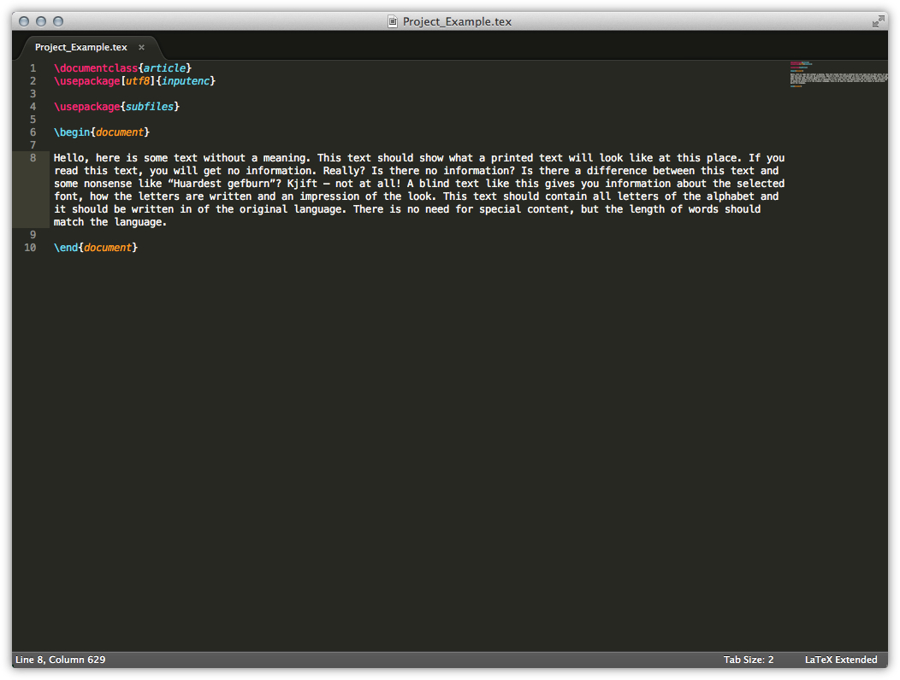
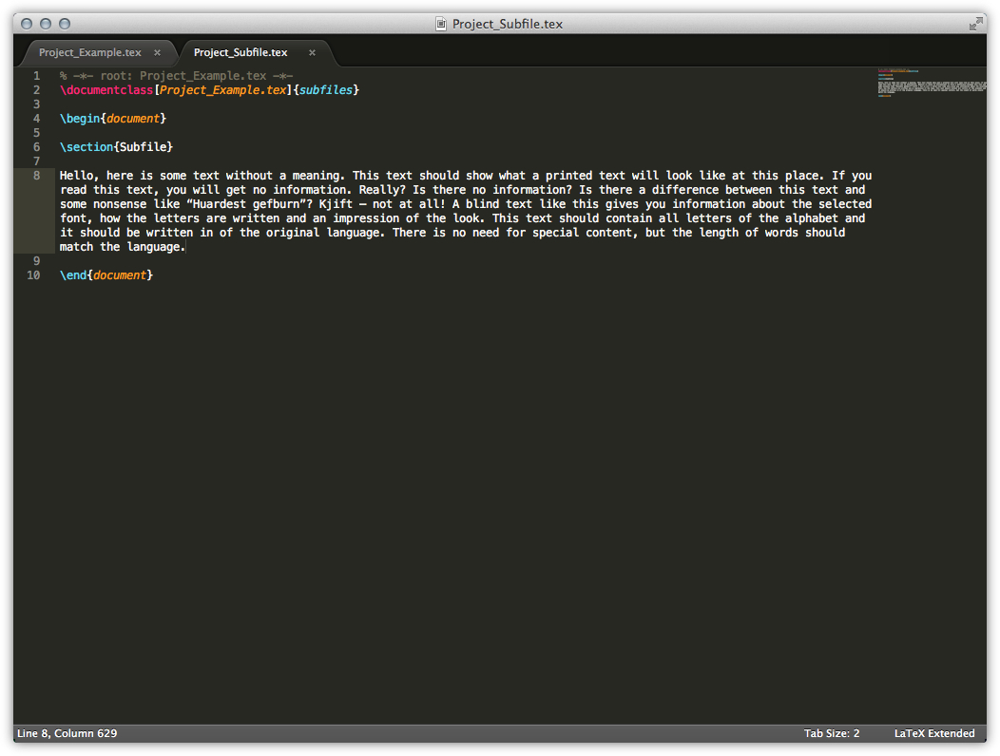
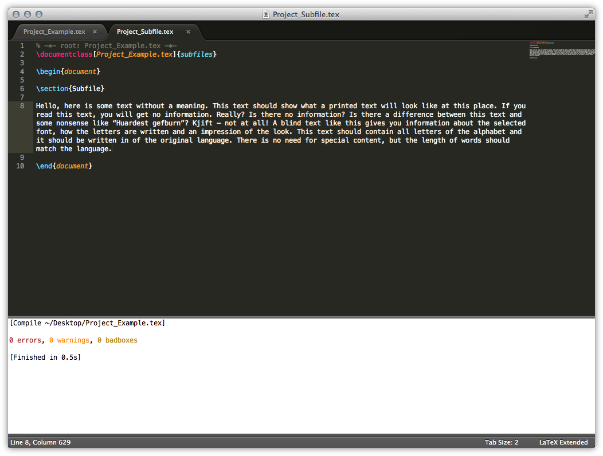
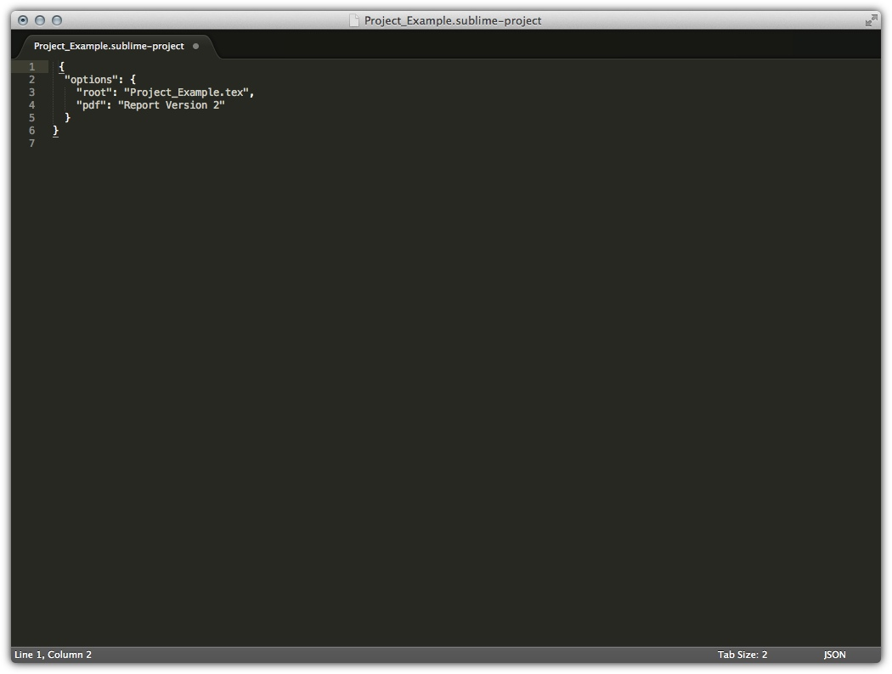

# Set up a Project

Normally if you writing a document in LaTeX you always want to have multi
files. This tutorial gives you an overview about the options within LaTeXing
to hand that situation. The support is wide, LaTeXing offers completing
citations, references, abbreviations (through the package acronym), and all
other availabke completions throughout the whole project.

You have to different ways of building up a project in LaTeXing. Both methods
do have there advantages and disadvantages depending on your use.

## First Method (Options)

In every file you can fill some options, see internal\_options-label for the
complete list. The important options for building up a multi files project is
**root**. Please follow the next steps to understand this is working.

Create the Root Document
------------------------

Within the root document you don't have to change anything; just create a file
as normal.

Create a Sub Document
---------------------

After creating your main document, you need to create individual sub-files. In
this screenshot the package subfiles is used, but the default commands
`\include` and `\input` are surely also supported. If you would like to
connect a sub-file with a main document, you have two different options. One
option is to create a Sublime Text project and the other one is just to add
the following line at the start of your tex file. The path can be absolute or
a relative path to the current tex file.

		% -*- root: Project_Example.tex -*-

> Using the subfiles class is a special case. LaTeXing will also recognise the
> project due to the option of the document class, therefore you could just
> leave the first line out for the subfile class.

Build the Project
-----------------

The screenshot below shows the success build, started from the subfile. It can
be seen in the log panel that the compiled file is the main file instead of
the currently selected sub-document.

## Second Method (Sublime Text project file)

Rather than adding an extra line to every sub files you can use a Sublime Text
project file, this is especially for huge projects with many files a nice
help. Just create a project file in the same directory like your main files
and save the root as option.

The path of the root file must be relative to the project file and will be
applied to all views in this window, please check the Sublime Text website if
you are not confident how to handle projects.

> As you can see it is also possible to define every internal option within a
> project file. These values are overwriting the in file options.
