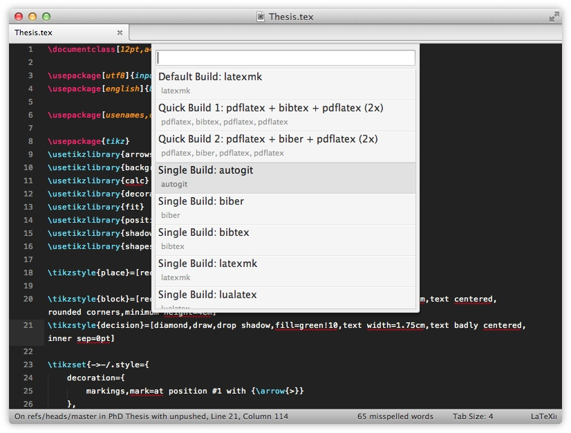

# Quick Build

[Latexmk][latexmk] is the default tool to build a pdf within LaTeXing but with
version 1.1 a novel build system and other options have been introduced. The
first one, and probably more easy one, is the ability of creating a custom
build order using the existing tools like pdflatex, bibtex, biber etc. Further
more it is possible to use user defined script like shell script on OSX and
Linux as well as Powershell on Windows.

To adjust the build process you have to adjust the sublime-build and
sublime-settings. The basic idea is simple and well structures, if you would
like to **adjust the build commands** itself, for example creating a new shell
script just adjust the sublime-build. On the other hand if you just would like
to **adjust the given commands** you meed to change the sublime-settings.

You have two different ways to call alternative build types, the first one is
to use the keybinding `super+l, suber+b` which shows all the available build
options and select **Build: Quick Build**, the other keybinding is
`super+ctrl+b` to open it straight away.

## Custom Script

If you need a deep control of the build process, for example if you prefer to
commit your entire changes to git prior building your project you can use a
custom script. In this example, on OSX, the well knows [Makefile][makefile] is
used and need to be placed next to your latex source files. To call it you
need to create an shell script *makefile.sh* now with the following content:

    now=$(date +"%T")
    git add -A
    git commit -m "Auto Commit: $now"

    make

At first the script calculates the time and then just commits all changes to
git followed by calling the make command. You can also use the output
directory settings if you which to, but you are responsible for handling it.
At the end of the build process LaTeXing expects the log and pdf file at the
right position inside your output directory. For this example the output
directory was disabled.

Now we just need to adjust the sublime-build to enable the call of the created
shell script. The sublime-build need to be extended **cmd_qb** by the first of the
following commands:

    "makefile": [
        "sh",
        "makefile.sh"
    ],
    /*
     * Use shell script on OSX or Linux
     */
    "autogit": [
        "sh",
        "autogit.sh"
    ],
    /*
     * Use batch file on Windows
     */
    "autogit_cmd": [
        "cmd",
        "/C",
        "autogit.bat"
    ],
     /*
     * Use powershell on Windows
     */
    "autogit_ps": [
        "powershell",
        "./autogit.bat"
    ]

You can also pass the available parameters like \{filebase\}, \{synctex\},
\{outdir\}, \{pdfname\}, or \{file\} to the script if you wish to. Now you can
just run a quick build and can see that the makefile command is available. You
can see an example how to use batch or powershell files on Windows.

**LaTeXing do not detect errors in external scripts, so before reporting a
problem be sure you can succesfully call the script from outside of
LaTeXing.** Anyway if you have a problem, enable the log mode and you check
the *.stderr.log file from your output directory for any possible error
messages.

## Custom Build Order

If you would like for example create a custom order with calling a shell
script to make an auto commit followed by the original latexmk you have to
change your settings like this.

    "quick_build": [
      {
        "name": "Default Build: pdflatex",
        "primary": true,
        "cmds": ["pdflatex"]
      },
      {
        "name": "Quick Build: autogit + latexmk",
        "cmds": ["autogit", "latexmk"]
      }
    ],

The command autogit needs to be completed like shows above. Now LaTeXing
executed the shell script *autogit.sh* followed by the original latexmk to
build the project. In case you want the new command to be default, just change
the default settings.

If you need further help, just check the forum, I am sure there are a few
examples of how to use this system shortly.

[latexmk]: http://www.ctan.org/pkg/latexmk
[makefile]: https://code.google.com/p/latex-makefile/