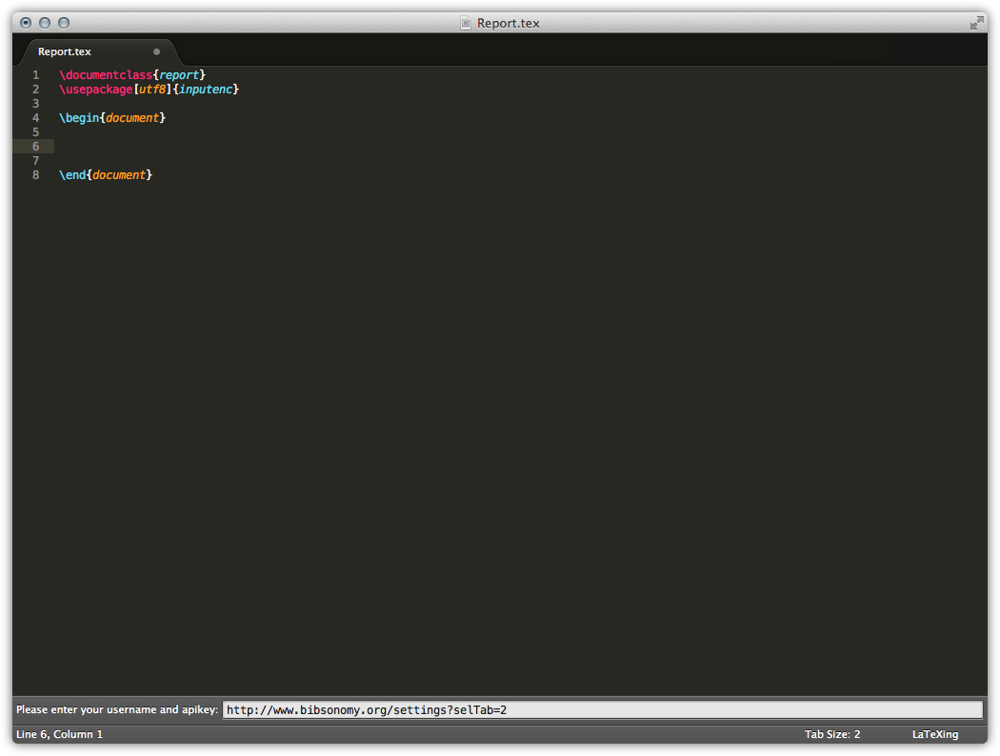
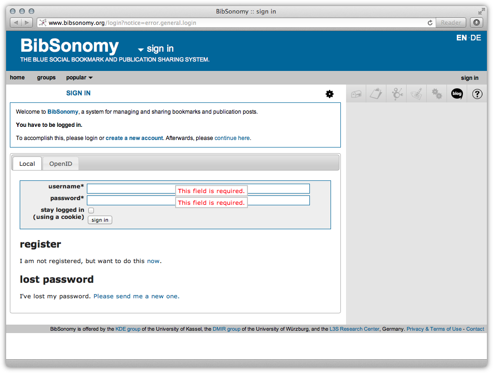
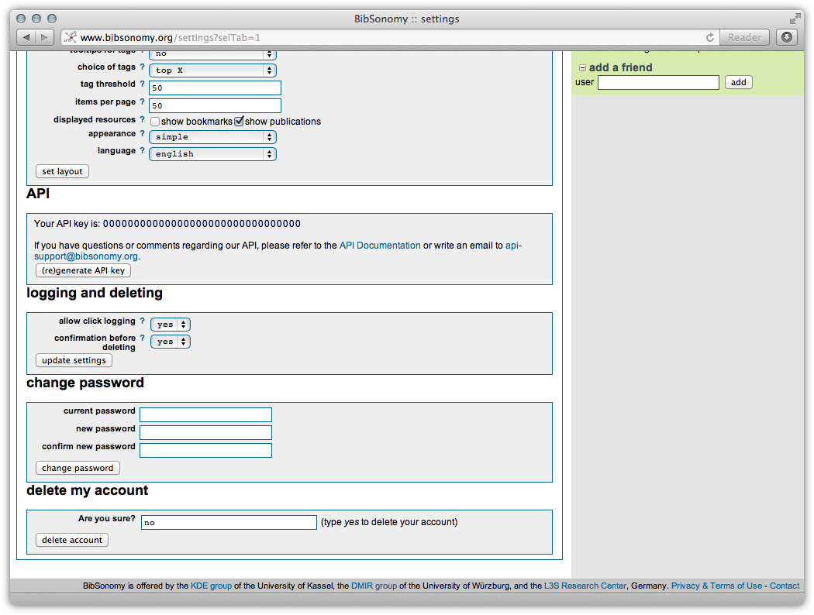
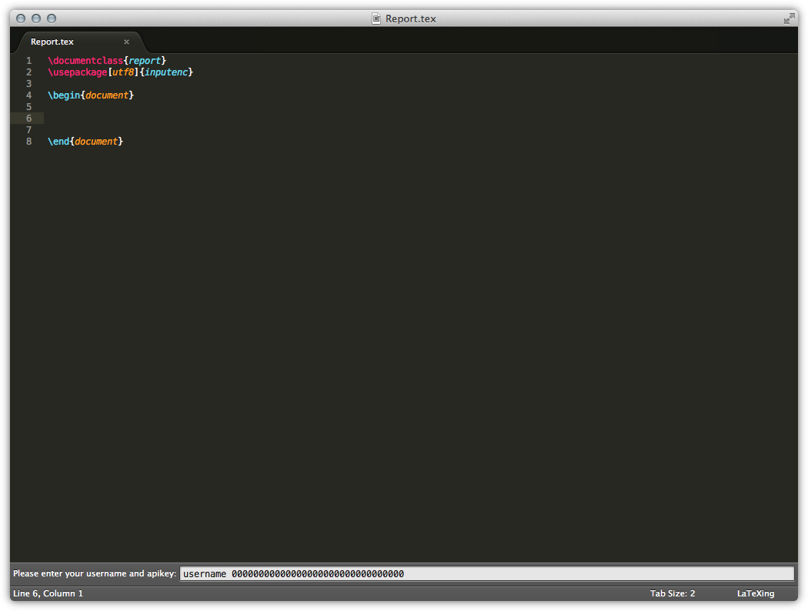
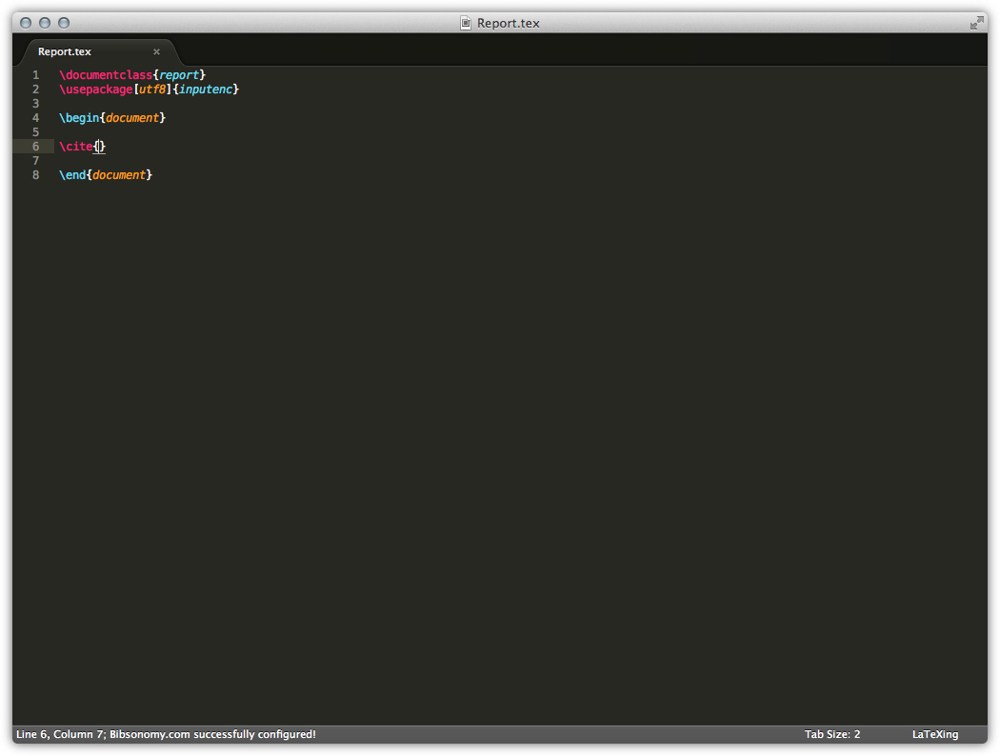
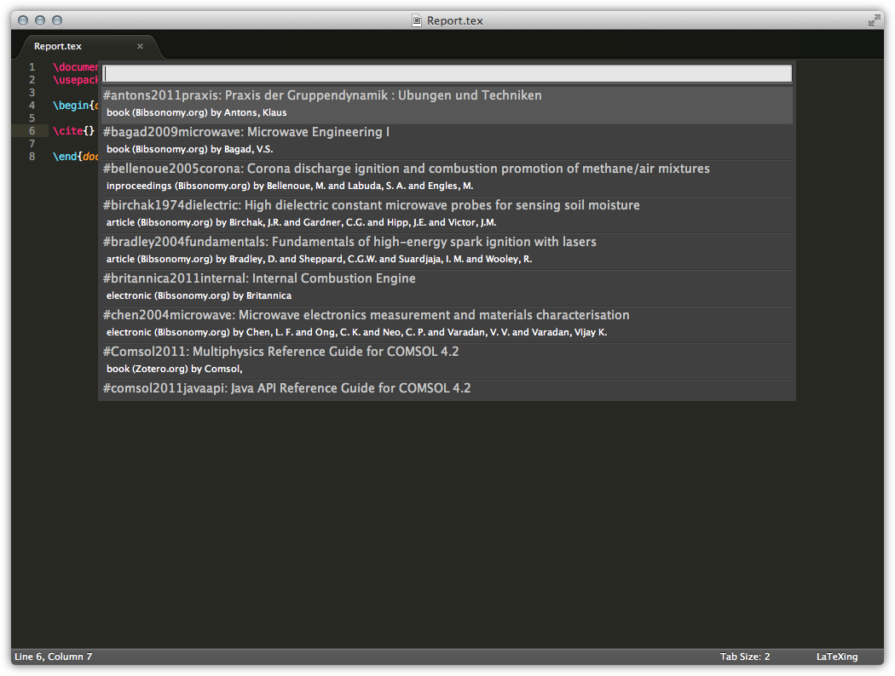

# Setup Bibsonomy with LaTeXing

LaTeXing offers a great support for the work together with Bibsonomy. This
feature was introduced with LaTeXing version 0.8. The steps to setting up
Bibsonomy are very simple and you just have to follow these steps
systematically.

Activate the **bibsonomy** option inside the LaTeXing.sublime-settings. At the
first moment LaTeXing tries to access some data from Bibsonomy and you haven't
set up the access the authorisation process will be initiated.

## Obtain the Api Key

For a successful communication between LaTeXing and Bibsonomy a private api
key is required. You have to login into your webaccound and generate this key.

At the bottom an input panel was created with a link, normally your standard
browser should automatically open this link and you don't have to copy the
link from there. The Bibsonomy website will open and you need to follow the
instructions there. If you are not reaching the shown website, please check
[Bibsonomy.org](http://www.bibsonomy.org/help/doc/gettingaccess.html) for more
details.

Log in with your default Bibsonomy login details.

Now you have to generate and/or copy the api key for LaTeXing, sroll down and
copy the api key and go back to LaTeXing.

## Enter the Username and Api key

With the api key code from Bibsonomy.org you can finalize the authorisation
process. Just type your username and paste the code in the input box and press
enter. Seperate the username and api key by a space.

If the authorisation was successful a status message will confirm this, shown
on the next picture.

## Using your Bibsonomy Database

> Just be award that you have to force LaTeXing to synchronise the data every
> time when you changes something and you wouldn't like to wait for the cache
> refresh. The synchronisation command will be a particle update and just the
> changed citations are updated.
