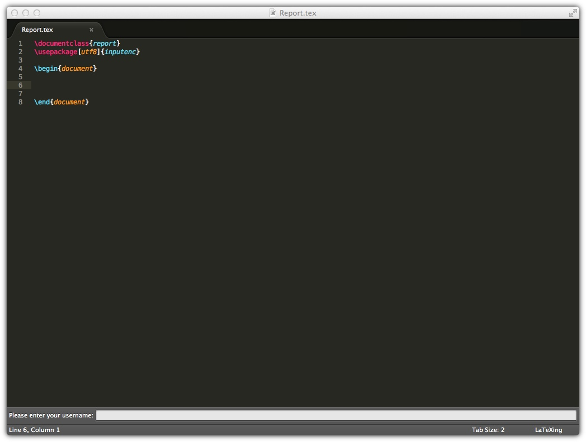
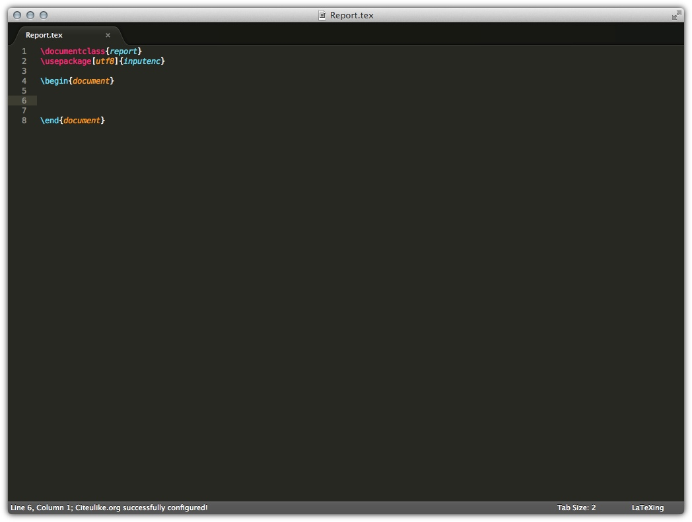
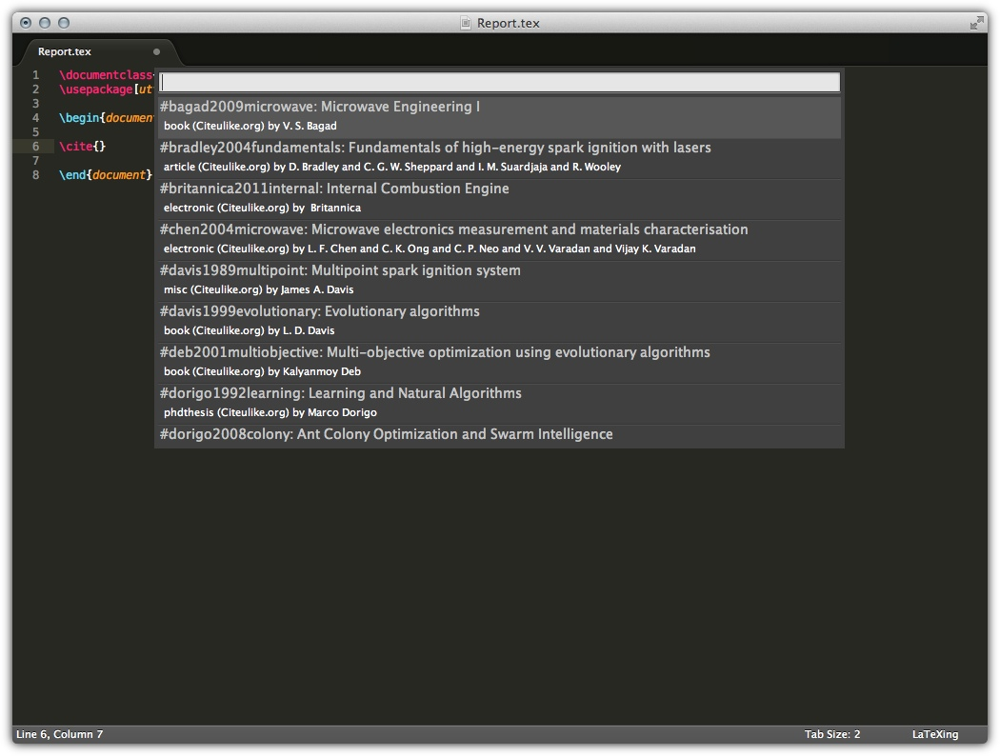

# Setup Citeulike with LaTeXing

LaTeXing offers a great support for the work together with Citeulike. This
feature was introduced with LaTeXing version 0.8. The steps to setting up
Citeulike are very simple and you just have to follow these steps
systematically.

Activate the **citeulike** option inside the LaTeXing.sublime-settings. At the
first moment LaTeXing tries to access some data from Citeulike and you haven't
set up the access the authorisation process will be initiated.

## Enter the Username

For a successful communication between LaTeXing and Citeulike you just have to
provide an username. At the bottom an input panel will apear and you just have
to fill your username in that panel.

If the authorisation was successful a status message will confirm this, shown
on the next picture.

## Using your Citeulike Database

> Just be award that you have to force LaTeXing to synchronise the data every
> time when you changes something and you wouldn't like to wait for the cache
> refresh. The synchronisation command will be a particle update and just the
> changed citations are updated.
