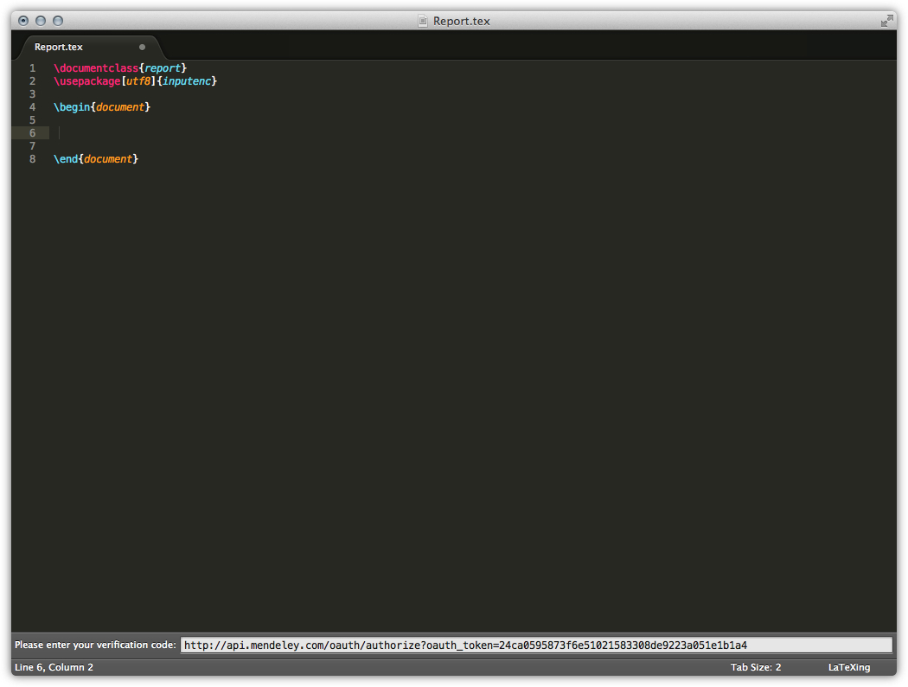
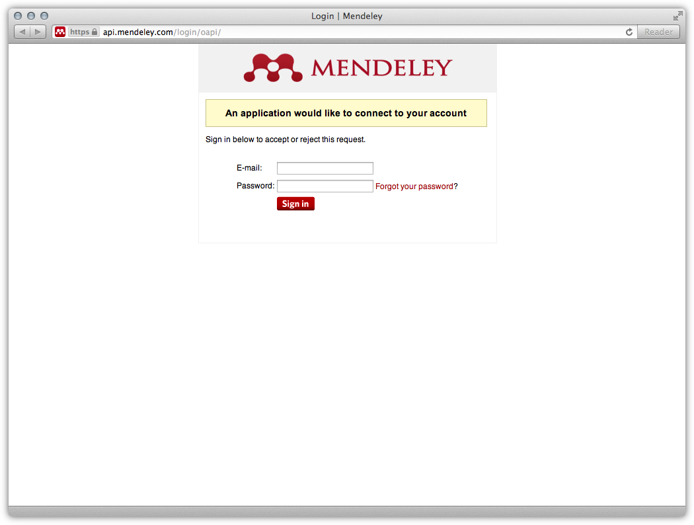
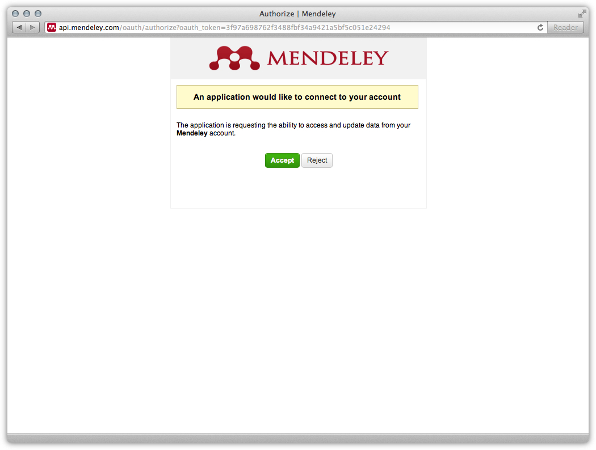
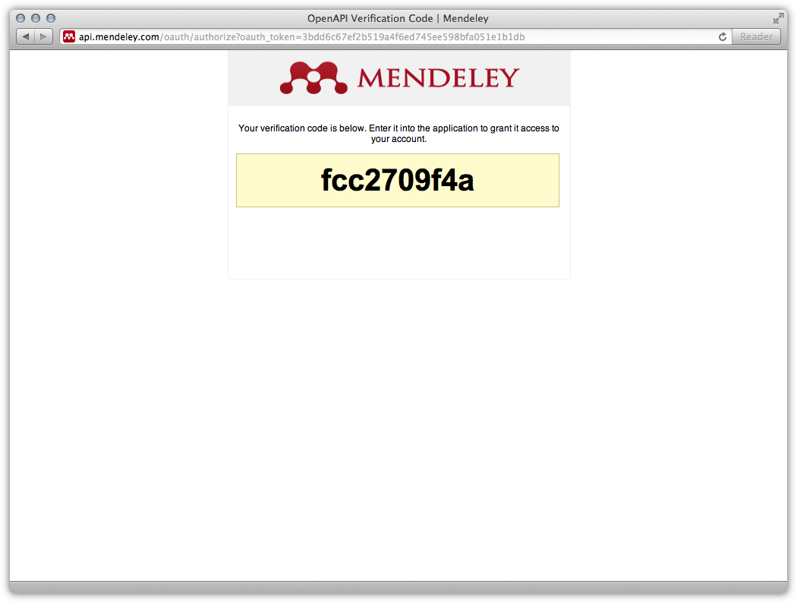
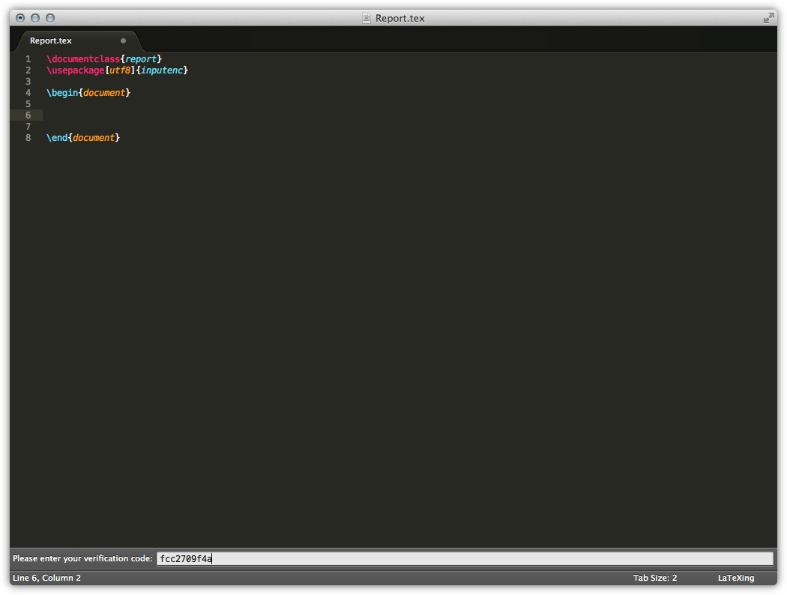
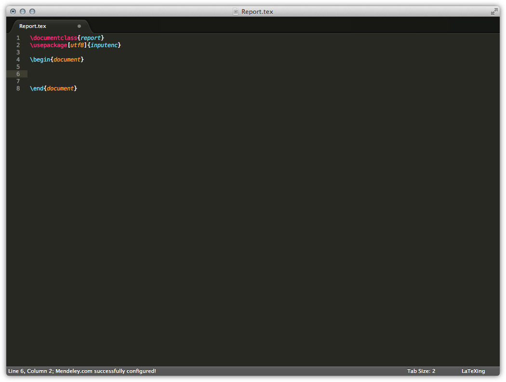
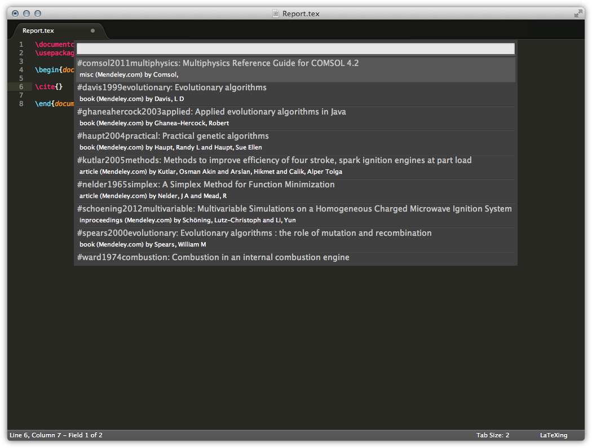
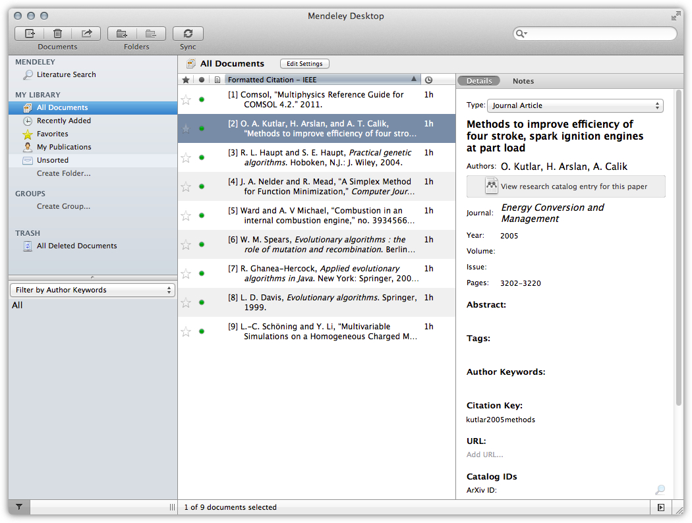

# Setup Mendeley with LaTeXing

LaTeXing offers a great support for the work together with Mendeley. This
feature was introduced with LaTeXing version 0.8. The steps to setting up
Mendeley are very simple and you just have to follow these steps
systematically.

> To work with Mendeley and Zotero you need the package oauthlib & SSL
> available from the package control.

Activate the **mendeley** option inside the LaTeXing.sublime-settings. At the
first moment LaTeXing tries to access some data from Mendeley and you haven't
set up the access the authorisation process will be initiated.

## Obtain the Verification Code

For a successful communication between LaTeXing and Mendeley a private key is
required. Normally you don't have to configure much instead LaTeXing is handle
all the handshakes for you.

At the bottom an input panel was created with a link, normally your standard
browser should automatically open this link and you don't have to copy the
link from there. The Mendeley website will open and you need to follow the
instructions there.

Log in with your default Mendeley login details.

Now you have to accept the access for LaTeXing.

After accepting the permissions the verification will be displayed and you
just need to copy this code and go back to LaTeXing.

## Enter the Verification Code

With the verification code from Mendeley.com you can finalize the
authorisation process. Just paste the code in the input box and press enter.

If the authorisation was successful a status message will confirm this, shown
on the next picture.

Now you are ready to use your Mendeley database without leaving LaTeXing; like
it is saved on your local machine for citations or import multiple items to
your local bibliography file.

## Using your Mendeley Database

Here the original database in Mendeley Desktop.

> Just be award that you have to force LaTeXing to synchronise the data every
> time when you changes something and you wouldn't like to wait for the cache
> refresh. The synchronisation command will be a particle update and just the
> changed citations are updated.
