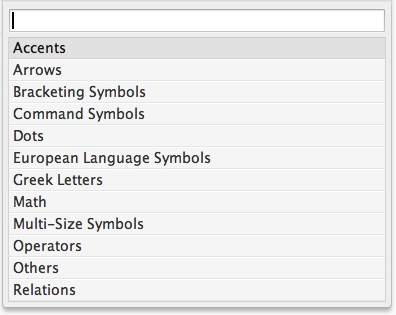
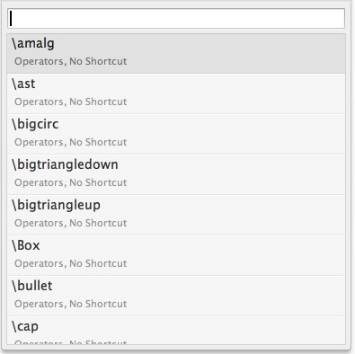

# Entering TeX Symbols

LaTeXing includes a range of completion snippets, which make entering math
symbols very easy. There are two triggers, `§` and `tab`, which follow a clear
logic: `§` expands the character(s) around the cursor for example into a
corresponding Greek symbol, while `tab` expands the character(s) left of the
cursor into math symbols by using the default auto completion of Sublime Text.
In this tutorial will just focus on the `§` trigger key.

> On Windows and Linux the trigger is <code>\`</code> and not the `§` which is
> used in this tutorial, so just use your right trigger key. Check the
> sublime-keymap files for the right command, you can also adjust the command
> in case your keyboard layout variates. If you which to use a different key,
> for example to adapt a different keyboard layout, you can change the key in
> the key bindings setting file.

Say you are in an equation environment and want to enter \alpha.

    \begin{equation}
      a
    \end{equation} 

You can expand a into \alpha by either hitting `tab` or `§`:

    \begin{equation}
      \alpha 
    \end{equation}

If you now hit `§` again, nothing happens because no 2nd expansion is
available for this Greek symbol and `§` already expanded to the Greek
character alpha. However, if you hit `tab` behind a single a it would result
in the same because it is the best match of the Sublime Text auto completion
as well.

The `tab` trigger lets you choose from a large number of symbols provided from
the \*.sublime-completions files, while `§` gives you direct access to the
frequently used Greek math characters and symbols. Finally, `§` lets you
quickly enter Greek symbols surrounded by opening and closing $ while writing
text outside of math environments. If you hit `§` in this situation LaTeXing
will expand a to the following:

    a[§] will change to $\alpha$

## Greek characters

Below is a list of currently implemented completions for Greek symbols.
When more than one symbol is listed, you can reach it by pressing `§`
repeatedly.

| Character   | 1st expansion   | 2nd exp.   | 3rd exp.   | 4th exp.   | 5th exp.     | 6th exp.      |
| ----------- | --------------- | ---------- | ---------- | ---------- | ------------ | ------------- |
| a           | \alpha          |            |            |            |              |               |          
| b           | \beta           |            |            |            |              |               |          
| d           | \delta          |            |            |            |              |               |          
| e           | \epsilon        |            |            |            |              |               |
| f           | \phi            |            |            |            |              |               |
| g           | \gamma          |            |            |            |              |               |
| h           | \eta            |            |            |            |              |               |
| i           | \iota           |            |            |            |              |               |
| j           | \theta          |            |            |            |              |               |
| k           | \kappa          |            |            |            |              |               |
| l           | \lambda         |            |            |            |              |               |
| m           | \mu             |            |            |            |              |               |
| n           | \nu             |            |            |            |              |               |
| p           | \pi             | \psi       |            |            |              |               |
| r           | \rho            |            |            |            |              |               |
| s           | \sigma          |            |            |            |              |               |
| t           | \tau            |            |            |            |              |               |
| u           | \upsilon        |            |            |            |              |               |
| v           | \varepsilon     | \varphi    | \varpi     | \varrho    | \varsigma    | \vartheta     |
| w           | \omega          |            |            |            |              |               |
| x           | \xi             |            |            |            |              |               |
| z           | \zeta           |            |            |            |              |               | 

Capital versions of Greek symbols are also available.

| Character   | 1st expansion   | 2nd expansion  |
| ----------- | --------------- | -------------- |
| D           | \Delta          |                |
| G           | \Gamma          |                |
| J           | \Theta          |                |
| L           | \Lambda         |                |
| O           | \Omega          |                |
| P           | \Pi             | \Psi           |
| S           | \Sigma          |                |
| X           | \Xi             |                |

## Arrows

Arrows are very useful but difficult to remember and long to type, with
the `§` trigger this is very easy and quick to complete.

| character   | 1st expansion      | 2nd expansion          |
| ----------- | ------------------ | ---------------------- |
| <-         | \leftarrow          | \longleftarrow         |
| <=         | \Leftarrow          | \Longleftarrow         |
| ->          | \rightarrow        | \longrightarrow        |
| =>          | \Rightarrow        | \Longrightarrow        |
| <->         | \leftrightarrow    | \longleftrightarrow    |
| <=>         | \Leftrightarrow    | \Longleftrightarrow    |

You can expand -> into \rightarrow by either hitting `§`:

    \begin{equation}
      -> 
    \end{equation}

If you now hit `§` again, nothing happens, if no 2nd expansion is available.
However, this is also working outside of math environments and LaTeXing
surround the command by opening and closing \$.

    \begin{equation}
      \rightarrow
    \end{equation}

## Other quick symbol shortcuts

Some commonly used math symbols (such as dots) are accessible via `§`
trigger as well (as always, further expansions can be reached via `§`
trigger).

| Character   | 1st expansion   | 2nd expansion   |
| ----------- | --------------- | --------------- |
| (           | \left(          |                 |
| )           | \right)         |                 |
| \[          | \left\[         |                 |
| \]          | \right\]        |                 |
| \|          | \left\|         | \right\|        |
| /           | \left/          | \right/         |
| .           | \dots           |                 |
| *           | \times          |                 |
| <           | \leq            |                 |
| >           | \geq            |                 |

> Outside of math environments < and > will expand to \textless and
> \textgreater

## Simultaneously enter open and closing parentheses

Using `tab` or `§` trigger you can enter open and closing parentheses more
quickly. Say you want to enter parentheses that adapt to the size of their
content, pressing one trigger when the cursor is within parentheses

    \begin{equation}
      ()
    \end{equation}

expands to

    \begin{equation}
      \left(\right)
    \end{equation}

This works for square brackets and curly braces as well.

Menu of symbols and commands
============================

There are too many math symbols and commands to memorize them all. Thus
LaTeXing can provide you with a menu to choose from. When in an empty math
environment pressing `§` on its own (i.e., without a preceding character)
opens a menu of available categories:

Entering a categories (press [enter]) allows you to choose from a range of
symbols and commands. You can also disable the list in categories with disable
the setting symbols\_in\_category.

